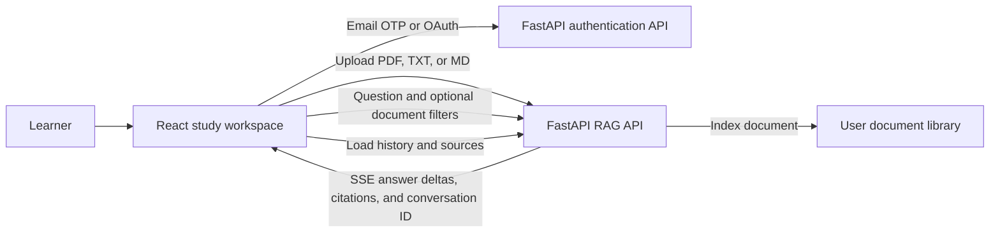

# Study Buddy

**Turn your own course materials into source grounded study sessions.**

Study Buddy is a full stack RAG study workspace. Learners upload notes and course documents, ask questions in a persistent chat, and follow citations back to the material used in each answer. This repository contains the React frontend; it connects to the companion FastAPI backend for authentication, document indexing, and retrieval augmented chat.

## Product tour

- **Bring your own materials:** Upload PDF, TXT, and Markdown files. Follow upload progress, review indexing details, download files, and remove documents from your library.
- **Ask questions as you study:** Chat answers stream into the page over server sent events, so learners can read while an answer is being generated.
- **Check the sources:** Answers include document citations with page or chunk context and expandable excerpts.
- **Keep studying later:** Conversations and message history are saved by the API and available from the recent chats list.
- **Sign in with a choice:** Register and sign in with email OTP, or start Google and GitHub OAuth.
- **Use it comfortably:** Responsive layouts, light and dark themes, protected account pages, and clear loading, empty, and error states support the full workflow.

## How it works



The browser sends authenticated requests to the API under `/api/v1`. Documents are indexed by the backend. Chat requests go to `POST /rag/chat/stream`; the frontend reads the SSE stream, renders answer deltas, and keeps the returned conversation ID for the next question. The complete endpoint contract is in [`src/data/API_ROUTES.md`](src/data/API_ROUTES.md).

## Engineering highlights

- **Streaming without a chat SDK:** The chat service reads the SSE response, handles `meta`, `delta`, `done`, and `error` events, supports aborting a request, and rejects incomplete streams instead of showing an unsaved answer as complete.
- **Cookie based session flow:** API calls include credentials. A shared Axios interceptor refreshes expired sessions and retries queued requests; the chat stream performs the equivalent refresh before retrying its fetch request.
- **Fast, bounded client caching:** In-flight list requests are shared. Documents and conversations are cached in memory for 20 seconds, messages for 30 seconds, and expiring download links for at most 55 seconds. Uploads and deletes invalidate affected data.
- **Useful failure states:** API validation and backend detail messages are surfaced to the learner with retry actions where appropriate. The public landing and sign-in routes remain available when the API is offline.
- **Safer file handling:** The frontend accepts PDF, TXT, and Markdown files up to 10 MiB and sends them as multipart form data. Session credentials are sent as cookies rather than stored in browser local storage.
- **Readable study answers:** Markdown inline emphasis and code are formatted; fenced code blocks include language labels, syntax colors, and a copy action.

## Tech stack

| Area | Tools |
| --- | --- |
| UI | React 19, TypeScript |
| Build | Vite |
| Routing | React Router |
| Styling | Tailwind CSS 4 |
| API | Axios for JSON requests; Fetch streams for SSE |
| Code quality | TypeScript, Oxlint |

## Run locally

### Prerequisites

- Node.js and npm
- The companion Study Buddy FastAPI backend running locally or on a reachable host

### Start the frontend

1. Install dependencies from the repository root:

   ```bash
   npm install
   ```

2. Create `.env` beside `package.json` and point it at the backend's versioned API base URL:

   ```dotenv
   VITE_BACKEND_URL=http://127.0.0.1:8000/api/v1
   ```

   Change the origin to match your backend and restart Vite after editing `.env`.

3. Configure backend CORS to allow the frontend origin and credentials. The authentication flow uses HTTP only session cookies.

4. Start Vite:

   ```bash
   npm run dev
   ```

   Open the local URL Vite prints, commonly `http://localhost:5173`.

The landing page can render without a running backend. Authentication, uploads, and study data need the API to be reachable; if it is not, the app reports the request failure in the relevant view.

## Main user flows

### Register with email

1. Submit an email address; the frontend calls `POST /auth/send-otp`.
2. Verify the emailed code with `POST /auth/verify-otp`.
3. Enter a name; the frontend calls `POST /auth/register` with `{ "email": "...", "full_name": "..." }`.
4. Load the signed in user from `GET /auth/me` and open the dashboard.

### Sign in with email

1. Submit an account email to `POST /auth/login` to request an OTP.
2. Verify it with `POST /auth/login/verify-otp`.
3. Load the current user and continue to the dashboard.

Google and GitHub sign in start at `/auth/google` and `/auth/github`. Signing out calls `/auth/logout`; expired sessions use `/auth/refresh`.

### Study with documents

Upload a document from the library, then ask a question in chat. Questions can target the whole library or up to 20 selected documents. The response streams into the conversation with citations and source excerpts. The learner can revisit or delete saved conversations from the chat list.

## Frontend routes

| Route | Page | Access |
| --- | --- | --- |
| `/` | Product landing page | Public |
| `/register` | Email OTP registration | Public |
| `/login` | Email OTP and social sign in | Public |
| `/dashboard` | Study overview | Signed in |
| `/chat` and `/chat/:chatId` | Streaming study conversations | Signed in |
| `/documents` | Document library | Signed in |
| `/settings` | Account and appearance | Signed in |

## Project layout

```text
src/
  api/          HTTP client, credentials, and session refresh
  components/   Shared layout and chat message rendering
  context/      Authentication state and provider
  data/         API route reference and local UI preferences
  hooks/        Authentication and theme hooks
  pages/        Landing, sign in, registration, dashboard, chat, library, settings
  routes/       Protected routes and not found handling
  services/     Authentication and RAG API operations
  types/        Shared API and study domain types
```

## Development commands

```bash
npm run dev      # Start the Vite development server
npm run lint     # Run Oxlint
npm run build    # Type check and create the production bundle
npm run preview  # Preview the production bundle locally
```
